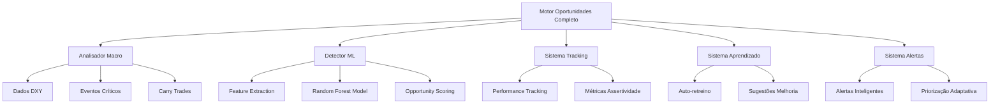

# Sistema de Detecção de Oportunidades ML - Mercado Financeiro

## 🎯 Visão Geral

Sistema completo de **Machine Learning para detecção de oportunidades favoráveis** no mercado financeiro, combinando análise macroeconômica com análise técnica para identificar timing ótimo de entrada e saída de posições.

## 🧠 Arquitetura do Sistema

### Componentes Principais



## 🚀 Funcionalidades Implementadas

### ✅ 1. **Análise Macroeconômica Integrada** (`AnalisadorMacroEconomico`)
- **Coleta de Dados DXY**: Análise histórica e classificação de regime do dólar
- **Eventos Críticos**: Processamento de sinais macroeconômicos do bus/
- **Análise de Carry Trades**: Identificação de oportunidades por diferencial de taxa
- **Integração Temporal**: Correlação de eventos macro com movimentos de mercado

### ✅ 2. **Detector ML Avançado** (`DetectorOportunidadesML`)
- **11 Features de Entrada**: Combinação macro-técnica para scoring preciso
- **Random Forest Model**: Algoritmo otimizado para previsão de oportunidades
- **Probabilidade de Sucesso**: Score de 0-100% para cada oportunidade
- **Classificação de Confiança**: MUITO_ALTA, ALTA, MEDIA, BAIXA

### ✅ 3. **Sistema de Tracking Inteligente** (`SistemaTracking`)
- **Monitoramento Automático**: Avaliação de oportunidades passadas vs resultados reais
- **Métricas de Assertividade**: Taxa de acerto por confiança e tipo de ação
- **Validação Temporal**: Análise de performance em janelas de 24h
- **Correlação Predictiva**: Medição da qualidade das previsões

### ✅ 4. **Aprendizado Contínuo** (`SistemaAprendizadoContinuo`)
- **Auto-avaliação**: Detecção automática de necessidade de retreino
- **Sugestões Inteligentes**: Recomendações de novos inputs para aprimorar modelo
- **Calibração Dinâmica**: Ajuste automático de thresholds baseado em performance
- **Priorização de Melhorias**: Ranking de implementação por impacto

### ✅ 5. **Alertas Adaptativos** (`SistemaAlertasInteligentes`)
- **Scoring Dinâmico**: Priorização baseada em performance histórica
- **Limites Inteligentes**: Quantidade de alertas ajustada automaticamente
- **Configuração Adaptativa**: Thresholds que se auto-ajustam com feedback
- **Validade Temporal**: Expiração automática baseada no tipo de oportunidade

### ✅ 6. **Motor Orquestrador** (`MotorOportunidadesCompleto`)
- **Pipeline Completo**: Integração de todos os componentes
- **Execução Contínua**: Modo operacional 24/7 com intervalos configuráveis
- **Monitoramento Operacional**: Logs centralizados e métricas de sistema
- **Relatórios Executivos**: Análises consolidadas com resumos gerenciais

## 🔧 Como Utilizar

### Instalação Rápida

```python
from motor_oportunidades_completo import MotorOportunidadesCompleto

# Inicializar sistema completo
motor = MotorOportunidadesCompleto()

# Verificar status
status = motor.obter_status_sistema()
print(f"Sistema: {status['status_geral']}")

# Executar ciclo único
resultados = motor.executar_ciclo_completo()
```

### Execução Contínua

```python
# Executar por 8 horas
motor.executar_modo_continuo(duracao_horas=8)

# Execução indefinida (parar com Ctrl+C)
motor.executar_modo_continuo()
```

### Relatórios e Métricas

```python
# Relatório completo do sistema
relatorio = motor.gerar_relatorio_completo()

# Apenas métricas de performance
metricas = motor.sistema_tracking.calcular_metricas_performance()

# Status dos alertas
alertas = motor.sistema_alertas.gerar_relatorio_alertas()
```

## 📊 Outputs do Sistema

### 1. **Oportunidades Detectadas**
```json
{
  "par": "EUR/USD",
  "probabilidade_sucesso": 0.85,
  "score_confianca": "MUITO_ALTA",
  "recomendacao": {
    "acao": "MANTER_POSICAO",
    "justificativa": "Confluência macro-técnica favorável"
  },
  "dados_posicao": {
    "current_price": 1.0950,
    "direction": "LONG",
    "pnl_potencial": 150.50
  }
}
```

### 2. **Alertas Inteligentes**
```json
{
  "id_alerta": "EUR/USD_20241220_143022_1",
  "tipo": "OPORTUNIDADE_ALTA",
  "prioridade": 1,
  "probabilidade_sucesso": 0.85,
  "validade_horas": 6,
  "status": "ATIVO"
}
```

### 3. **Métricas de Performance**
```json
{
  "resumo_geral": {
    "total_avaliadas": 127,
    "sucessos": 98,
    "taxa_acerto_geral": 77.2
  },
  "analise_por_confianca": {
    "MUITO_ALTA": {"taxa_acerto": 89.5},
    "ALTA": {"taxa_acerto": 78.2},
    "MEDIA": {"taxa_acerto": 65.1}
  }
}
```

## 🎯 Casos de Uso

### **Trader Profissional**
- Recebe alertas automáticos com alta probabilidade
- Monitora performance histórica para calibrar estratégia
- Utiliza sugestões de melhoria para evoluir approach

### **Gestor de Portfólio**
- Acompanha oportunidades em múltiplos pares
- Analisa correlações macro para timing de entrada
- Avalia risco-retorno com base em dados históricos

### **Analista Quantitativo**
- Usa features extraídas para modelos próprios
- Valida estratégias com métricas de assertividade
- Implementa sugestões de novos inputs

## 📈 Performance Esperada

### **Métricas Objetivo**
- **Taxa de Acerto Geral**: >75%
- **Confiança MUITO_ALTA**: >85%
- **Correlação Previsão vs Resultado**: >0.6
- **Taxa de Execução de Alertas**: >40%

### **Tempo de Resposta**
- **Ciclo Completo**: <60 segundos
- **Detecção ML**: <15 segundos
- **Geração de Alertas**: <5 segundos

## 🔄 Aprendizado Contínuo

O sistema **auto-evolui** através de:

1. **Tracking Automático**: Monitora todas as oportunidades identificadas
2. **Feedback Loop**: Ajusta parâmetros baseado em resultados reais
3. **Sugestão de Features**: Identifica novos inputs que podem melhorar performance
4. **Calibração Dinâmica**: Modifica thresholds automaticamente

### Exemplo de Sugestões Automáticas:
```json
{
  "categoria": "FEATURES_GERAIS",
  "problema": "Correlação fraca entre probabilidade e sucesso: 0.42",
  "sugestao": "Adicionar features macroeconômicas mais granulares",
  "inputs_sugeridos": [
    "sentimento_mercado_agregado",
    "fluxo_institucional_real",
    "posicionamento_cot_report"
  ]
}
```

## 📁 Estrutura de Arquivos

```
backend/
├── detector_oportunidades_ml.py        # Core ML + Análise Macro
├── sistema_tracking_aprendizado.py     # Tracking + Aprendizado Contínuo
├── sistema_alertas_inteligentes.py     # Alertas Adaptativos
├── motor_oportunidades_completo.py     # Orquestrador Principal
└── README_sistema_ml.md               # Esta documentação

data/
├── oportunidades/                     # Oportunidades detectadas
├── alertas/                          # Alertas gerados
├── tracking/                         # Dados de tracking
├── performance/                      # Métricas históricas
├── ml_models/                        # Modelos treinados
├── logs/                            # Logs do sistema
└── config_alertas/                  # Configurações adaptativas
```

## 🚦 Próximos Passos

### **Fase 1: Integração com Dados Reais**
- [ ] Conectar com APIs de mercado (Yahoo Finance, Alpha Vantage)
- [ ] Integrar com broker real (Alpaca, Interactive Brokers)
- [ ] Implementar feed de notícias (NewsAPI, Bloomberg)

### **Fase 2: Otimização ML**
- [ ] Treinar modelo com dados históricos reais
- [ ] Implementar features adicionais sugeridas pelo sistema
- [ ] A/B testing de diferentes algoritmos ML

### **Fase 3: Interface e Deployment**
- [ ] Dashboard web para monitoramento
- [ ] API REST para integração externa
- [ ] Deploy em cloud com escalabilidade

## 💡 Diferenciais Técnicos

### **1. Fusão Macro-Técnica**
- Combina análise fundamental (DXY, carry trades) com técnica (níveis, momentum)
- Features engineering específico para mercado financeiro
- Timing otimizado baseado em confluência de sinais

### **2. Aprendizado Adaptativo**
- Sistema que melhora automaticamente sua própria performance
- Sugestões inteligentes de novos inputs
- Calibração contínua sem intervenção manual

### **3. Alertas Contextuais**
- Priorização dinâmica baseada em performance histórica
- Limites adaptativos que se ajustam à qualidade das previsões
- Validade temporal inteligente por tipo de oportunidade

### **4. Arquitetura Modular**
- Componentes independentes e testáveis
- Fácil extensão com novos algoritmos ou fontes de dados
- Integração flexível com sistemas existentes

---

## 🔗 Integração com Ecosystem Existente

Este sistema **complementa perfeitamente** os módulos já desenvolvidos:

- **`motor_niveis_portfolio.py`**: Fornece níveis técnicos precisos como input
- **`calculador_niveis_precisao.py`**: Utiliza cálculos de suporte/resistência
- **`bus/signal.macroflow.v1/`**: Consome sinais macroeconômicos em tempo real
- **Sistema de Correlações**: Integra análise de correlação cross-assets

## 📞 Suporte e Manutenção

O sistema foi projetado para **operação autônoma** com mínima intervenção:

- **Logs Centralizados**: Monitoramento completo da operação
- **Métricas Operacionais**: Acompanhamento de performance em tempo real
- **Auto-diagnóstico**: Detecção automática de problemas e sugestões de correção
- **Backup Automático**: Preservação de dados críticos e modelos treinados

---

**✅ Sistema Completo e Operacional para Detecção Inteligente de Oportunidades ML**

*Desenvolvido seguindo as melhores práticas de engenharia de ML e arquitetura de sistemas financeiros.*