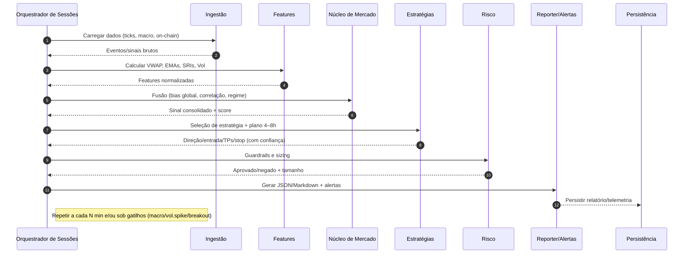
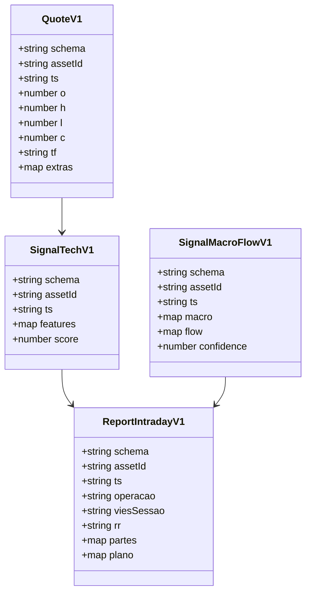

# Arquitetura – Visão Visual (End-to-End)

Este documento apresenta a visualização do processo ponta a ponta do agente, do evento/ingestão até o relatório/alerta, com vistas ao barramento de sinais e à orquestração de sessões.

---

## 1) Visão Geral (Layers)

```mermaid
flowchart TB
  subgraph Ingestao[Ingestão de Dados]
    A1[Preços (yfinance)]
    A2[Calendário Macro (mock/APIs)]
    A3[Notícias/Headlines]
    A4[On-Chain (mock/APIs)]
  end

  subgraph Features[Engenharia de Sinais]
    B1[Normalização / Limpesa]
    B2[Indicadores (VWAP, EMAs, ATR, SRIs)]
    B3[Volatilidade/Regimes]
  end

  subgraph Nucleo[Núcleo de Mercado (Fusão)]
    C1[Bias Global (DXY, Yields, Commodities, Crypto Cap)]
    C2[Correlação/Conflitos]
    C3[Ponderação por Regime]
  end

  subgraph Estrategias[Estratégias & Decisão]
    D1[Selector de Estratégias]
    D2[Plano 4–8h (Entrada/TPs/Stop)]
  end

  subgraph Risco[Risco & Exposição]
    E1[Guardrails (limites/correlação)]
    E2[Sizing por Risco / R:R]
  end

  subgraph Execucao[Execução & Relatórios]
    F1[Relatório Intraday (JSON+MD)]
    F2[Alertas]
    F3[Paper/Execução]
  end

  subgraph Historico[Persistência & Observabilidade]
    G1[SQLite → PostgreSQL]
    G2[Métricas (latência, hit-rate)]
    G3[Logs/Trace/Lineage]
  end

  Ingestao --> Features --> Nucleo --> Estrategias --> Risco --> Execucao --> Historico
```

---

## 2) Orquestração por Sessão



---

## 3) Barramento de Sinais (Producers/Consumers)

```mermaid
flowchart LR
  subgraph Producers[Produtores]
    P1[market.tick]
    P2[macro.calendar]
    P3[macro.news]
    P4[onchain.metric]
  end

  subgraph Bus[Barramento de Sinais]
    Q1[Fila Alta Prioridade (macro)]
    Q2[Fila Normal (ticks/tech)]
  end

  subgraph Consumers[Consumidores]
    R1[Features]
    R2[Fusão (Core)]
    R3[Estratégias]
    R4[Risco]
    R5[Reporter]
  end

  Producers --> Bus --> Consumers
```

---

## 4) Contratos e Dados (Visão Estrutural)



---

Notas

- As figuras usam Mermaid e podem ser renderizadas no GitHub ou com extensões de preview no VS Code.
- O diagrama 1 dá a visão macro por camadas; 2 descreve o fluxo orquestrado; 3 mostra produtores/consumidores do barramento; 4 mostra a estrutura dos contratos.
