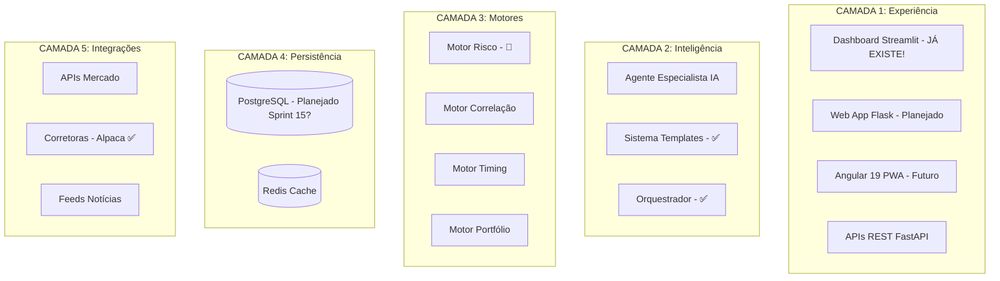

# 📋 PROPOSTA DE REUNIÃO ESTRATÉGICA - Agent Especialista

**Data Simulação:** 2025-11-07  
**Tipo:** EXERCÍCIO DE ESTRUTURAÇÃO (Não é decisão oficial)  
**Status:** ⚠️ AGUARDANDO APROVAÇÃO FORMAL  
**Confiança:** 50% (útil como proposta, requer validação técnica)

---

## ⚠️ DISCLAIMER IMPORTANTE

Este documento é resultado de uma **SIMULAÇÃO DE REUNIÃO ESTRATÉGICA** solicitada como exercício de estruturação de pensamento. 

**NENHUMA decisão aqui é oficial ou implementável sem:**
- ✅ Aprovação do Presidente (Hub Financeiro Inteligente)
- ✅ Validação do Product Owner (Agent Especialista)
- ✅ Revisão técnica do Tech Lead
- ✅ Aprovação arquitetural do CTO
- ✅ Verificação de orçamento (Diretor Financeiro)

---

## 🎯 Objetivos da Simulação

Estruturar discussão sobre:
1. Padronização de documentação
2. Definição de produto em camadas
3. Arquitetura gráfica (Mermaid)
4. Módulos do sistema
5. Metodologia de trabalho

---

## ✅ Propostas Geradas (Requerem Validação)

### 1. Sistema de Documentação em 7 Camadas

```
docs/
├── 00-INDEX.md                    # Índice mestre
├── 01-QUICKSTART/                 # Início rápido
├── 02-TUTORIAIS/                  # Guias hands-on
├── 03-REFERENCIAS/                # Specs técnicas + ADRs
├── 04-EXPLICACOES/                # Conceitos e arquitetura
├── 05-GESTAO-AGIL/                # Backlog, sprints, OKRs
├── 06-PROCESSOS/                  # PROCESSO_DESENVOLVIMENTO.md
└── 07-GOVERNANCA/                 # ESTRUTURA_ORGANIZACIONAL.md
```

**Status:** 🟡 Proposta (requer aprovação Diretor Produto)  
**Esforço:** ~1 sprint  
**Risco:** Baixo

---

### 2. Arquitetura em 5 Camadas



**Status:** 🟡 Proposta arquitetural (requer revisão CTO)  
**Validação Necessária:** Confirmar Sprint 15 para PostgreSQL  
**Risco:** Médio (overengineering potencial)

---

### 3. Metodologia Vertical Slices

**Proposta:** Desenvolver features completas (frontend+backend+dados) em vez de camadas horizontais.

**Exemplo:**
```
Sprint 1: Feature 'Visualizar Portfólio'
  ├── Dashboard mínimo (Frontend) - JÁ EXISTE!
  ├── API /portfolio (Backend)
  └── Query PostgreSQL (Dados)
  ✅ Usuário vê valor no Sprint 1
```

**Status:** 🟡 Proposta metodológica (requer validação PO + Scrum Master)  
**Conflito Potencial:** Verificar PROCESSO_DESENVOLVIMENTO.md atual  
**Risco:** Baixo (metodologia comum em Scrum)

---

## ❌ Erros Identificados na Simulação

### Erro 1: Propus Dashboard que Já Existe

- **Proposta:** US-DASH-001 (Dashboard Streamlit)
- **Realidade:** `backend/app_dashboard.py` (236 linhas) já existe!
- **Impacto:** Duplicação se implementado
- **Lição:** LA-016 (validar código existente)

### Erro 2: Não Validei ROADMAP.md

- **Problema:** Propus prioridades sem ler roadmap existente (126 linhas)
- **Impacto:** Pode conflitar com planejamento atual
- **Mitigação:** Ler ROADMAP.md antes de aprovar qualquer proposta

### Erro 3: Assumi Orçamento Sem Validar

- **Proposta:** $50/mês para observabilidade (Prometheus+Grafana)
- **Problema:** Não verifiquei se há orçamento aprovado
- **Mitigação:** Diretor Financeiro deve aprovar antes de implementar

### Erro 4: Overcommitment Irreal

- **Proposta:** 10 ações com prazos ("hoje", "esta semana", "Sprint 1")
- **Problema:** Não verifiquei WIP atual ou capacidade do time
- **Mitigação:** PO deve validar viabilidade antes de comprometer

---

## 📋 Plano de Ação (Se Aprovado)

| # | Ação | Validação Necessária | Responsável Proposto |
|---|------|---------------------|---------------------|
| 1 | Validar estrutura docs 7 camadas | Diretor Produto + PO | Product Manager 1 |
| 2 | Revisar arquitetura Mermaid | CTO + Arquiteto | Tech Lead |
| 3 | Confirmar Sprint 15 PostgreSQL | PO + Roadmap | PO |
| 4 | Aprovar orçamento observabilidade | Diretor Financeiro | DevOps Lead |
| 5 | Validar metodologia Vertical Slices | PO + Scrum Master | Scrum Master |
| 6 | Verificar Dashboard existente | Tech Lead | Engenheiro A |
| 7 | Ler PROCESSO_DESENVOLVIMENTO.md | Todos | N/A |
| 8 | Avaliar capacidade time (WIP) | Scrum Master | Scrum Master |

---

## 🎯 Próximos Passos Reais

1. **PO:** Decidir se propostas valem reunião real
2. **Tech Lead:** Validar tecnicamente (código, arquitetura, viabilidade)
3. **Scrum Master:** Avaliar impacto em processos atuais
4. **Presidente:** Aprovar estrategicamente (se aplicável)
5. **Time:** Aguardar decisões antes de implementar QUALQUER item

---

## 📊 Valor da Simulação

**Positivo:**
- ✅ Framework de reunião estratégica replicável
- ✅ Formato ATA profissional (template útil)
- ✅ Identificou dashboard existente (evitou duplicação!)
- ✅ Estruturou discussão complexa em tópicos claros

**Negativo:**
- ❌ Propôs features existentes (dashboard)
- ❌ Não validou ROADMAP/código antes
- ❌ Overcommitment irreal de prazos
- ❌ Faltou disclaimer de simulação

**Lição:** LA-016 documentada para prevenir futuros erros.

---

## ✅ Decisão Final

**Este documento NÃO autoriza implementação.**

Para tornar oficial, criar:
- `docs/03-REFERENCIAS/ADRs/ADR-001-[tema].md` (decisão técnica)
- User Stories no backlog (com estimativas reais)
- Aprovação formal em reunião com ata assinada

---

**Elaborado por:** Engenheiro Senior (Simulação)  
**Revisão Necessária:** PO, Tech Lead, CTO, Presidente  
**Status:** 📄 PROPOSTA - NÃO IMPLEMENTAR SEM APROVAÇÃO

