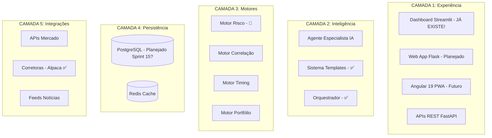
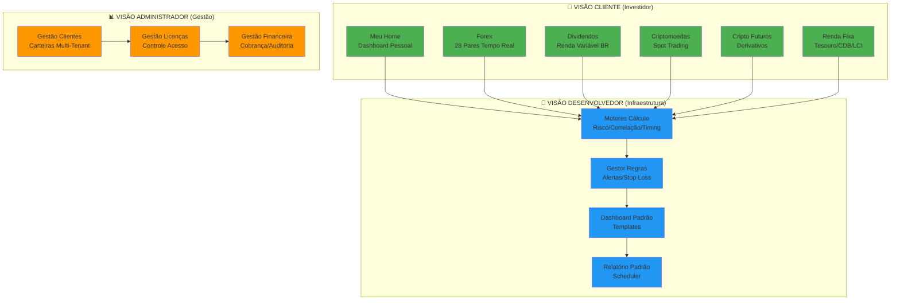

# 📋 PROPOSTA DE REUNIÃO ESTRATÉGICA - Agent Especialista

**Data Simulação:** 2025-11-07  
**Tipo:** EXERCÍCIO DE ESTRUTURAÇÃO (Não é decisão oficial)  
**Status:** ⚠️ AGUARDANDO APROVAÇÃO FORMAL  
**Confiança:** 50% (útil como proposta, requer validação técnica)

---

## ⚠️ DISCLAIMER IMPORTANTE

Este documento é resultado de uma **SIMULAÇÃO DE REUNIÃO ESTRATÉGICA** solicitada como exercício de estruturação de pensamento. 

**NENHUMA decisão aqui é oficial ou implementável sem:**
- ✅ Aprovação do Presidente (Hub Financeiro Inteligente)
- ✅ Validação do Product Owner (Agent Especialista)
- ✅ Revisão técnica do Tech Lead
- ✅ Aprovação arquitetural do CTO
- ✅ Verificação de orçamento (Diretor Financeiro)

---

## 🎯 Objetivos da Simulação

Estruturar discussão sobre:
1. Padronização de documentação
2. Definição de produto em camadas
3. Arquitetura gráfica (Mermaid)
4. Módulos do sistema
5. Metodologia de trabalho

---

## ✅ Propostas Geradas (Requerem Validação)

### 1. Sistema de Documentação em 7 Camadas

```
docs/
├── 00-INDEX.md                    # Índice mestre
├── 01-QUICKSTART/                 # Início rápido
├── 02-TUTORIAIS/                  # Guias hands-on
├── 03-REFERENCIAS/                # Specs técnicas + ADRs
├── 04-EXPLICACOES/                # Conceitos e arquitetura
├── 05-GESTAO-AGIL/                # Backlog, sprints, OKRs
├── 06-PROCESSOS/                  # PROCESSO_DESENVOLVIMENTO.md
└── 07-GOVERNANCA/                 # ESTRUTURA_ORGANIZACIONAL.md
```

**Status:** 🟡 Proposta (requer aprovação Diretor Produto)  
**Esforço:** ~1 sprint  
**Risco:** Baixo

---

### 2. Arquitetura em 5 Camadas



**Status:** 🟡 Proposta arquitetural (requer revisão CTO)  
**Validação Necessária:** Confirmar Sprint 15 para PostgreSQL  
**Risco:** Médio (overengineering potencial)

---

### 3. Módulos do Sistema Orientados a Valor

**Princípio:** Módulos organizados por **PERSONA** e **VALOR ENTREGUE**, não por camada técnica.

#### 📊 VISÃO ADMINISTRADOR (Gestão da Plataforma)

```
Módulos:
├── Gestão de Clientes
│   └── Funcionalidades:
│       ├── Cadastro/edição clientes
│       ├── Visualizar carteira por cliente
│       ├── Histórico de operações
│       └── Exportar relatórios (PDF/Excel)
│
├── Gestão de Licenças
│   └── Funcionalidades:
│       ├── Ativar/desativar licenças
│       ├── Controle de limites (posições/ativos)
│       ├── Renovação automática
│       └── Dashboard de uso
│
└── Gestão Financeira
    └── Funcionalidades:
        ├── Cobrança e faturamento
        ├── Auditoria de transações
        ├── Controle de custos (APIs/infra)
        └── Relatórios financeiros
```

#### 🔧 VISÃO DESENVOLVEDOR (Infraestrutura e Motores)

```
Módulos:
├── Motores de Cálculo
│   └── Funcionalidades:
│       ├── Motor de Risco (RMS) - 🔄 Em progresso
│       ├── Motor de Correlação
│       ├── Motor de Timing
│       └── Motor de Portfolio
│
├── Gestor de Regras (Rule Engine)
│   └── Funcionalidades:
│       ├── Configurar alertas personalizados
│       ├── Stop loss/take profit automático
│       ├── Rebalanceamento de carteira
│       └── Compliance e limites
│
├── Dashboard Padrão (Template)
│   └── Funcionalidades:
│       ├── Widgets drag-and-drop
│       ├── Temas personalizáveis
│       ├── Exportar/importar layouts
│       └── Biblioteca de componentes
│
└── Relatório Padrão (Template)
    └── Funcionalidades:
        ├── Templates customizáveis
        ├── Scheduler (diário/semanal/mensal)
        ├── Multi-formato (PDF/Excel/JSON)
        └── Envio automático (email/webhook)
```

#### 👤 VISÃO CLIENTE (Usuário Final - Investidor)

```
Módulos:
├── Meu Home (Dashboard Pessoal)
│   └── Funcionalidades:
│       ├── Visão consolidada portfólio
│       ├── P&L diário/mensal/anual
│       ├── Alertas e notificações
│       └── Atalhos personalizados
│
├── Forex
│   └── Funcionalidades:
│       ├── Cotações tempo real (28 pares)
│       ├── Análise técnica + fundamentalista
│       ├── Correlações entre pares
│       ├── Calendário econômico
│       └── Recomendações IA
│
├── Dividendos (Renda Variável BR)
│   └── Funcionalidades:
│       ├── Calendário de proventos
│       ├── Análise fundamentalista (valuation)
│       ├── Histórico de dividendos
│       ├── Yield on cost
│       └── Sugestões de carteira
│
├── Criptomoedas (Spot)
│   └── Funcionalidades:
│       ├── Top 100 cryptos
│       ├── Análise on-chain
│       ├── Sentimento de mercado
│       ├── DCA automático
│       └── Staking rewards
│
├── Cripto Futuros (Derivativos)
│   └── Funcionalidades:
│       ├── Contratos perpétuos
│       ├── Funding rate monitor
│       ├── Liquidation heatmap
│       ├── Estratégias alavancadas
│       └── Gestão de margem
│
└── Renda Fixa
    └── Funcionalidades:
        ├── Simulador Tesouro Direto
        ├── CDBs/LCIs/Debentures
        ├── Comparador de taxas
        ├── Projeção de rentabilidade
        └── Ladder de vencimentos
```

---

### 4. Metodologia de Entrega: VALOR-FIRST (Vertical Slices)

**Princípio:** Cada entrega deve ser **100% funcional, documentada e produtiva** para UMA funcionalidade específica.

**Exemplo de Entrega Vertical Completa:**

```
US-CLIENTE-001: [Forex] Visualizar Cotações Tempo Real

CAMINHO DE VALOR (Frontend → Backend → Dados):

📱 FRONTEND (Módulo Forex)
├── Tela: Lista de 28 pares de moedas
├── Componente: Card de cotação (bid/ask/spread)
├── WebSocket: Atualização tempo real
├── Loading states + error handling
└── Responsivo (mobile/desktop)

⚙️ BACKEND (API + Motor)
├── Endpoint: GET /api/forex/quotes
├── WebSocket server (streaming)
├── Integração: Alpha Vantage API
├── Cache Redis (1 segundo)
└── Rate limiting

💾 DADOS (Persistência)
├── Tabela: forex_quotes_realtime
├── Histórico: 30 dias (TimescaleDB)
├── Índices: (par, timestamp)
└── Particionamento por dia

📚 DOCUMENTAÇÃO
├── README: Como usar o módulo Forex
├── API docs: Swagger/OpenAPI
├── Tutorial: "Primeiras cotações em 5 min"
└── Troubleshooting comum

✅ TESTES
├── E2E: Abrir tela → Ver cotação atualizada
├── Unit: Formatação de moedas, cálculo spread
├── Integration: API → Cache → BD
└── Performance: <200ms p95

🚀 PRODUÇÃO
├── Deploy staging → validação → produção
├── Feature flag (ativar progressivamente)
├── Monitoring: Latência, taxa de erro
└── Rollback plan
```

**Resultado:** Cliente **USA** cotações Forex em produção ao final do sprint!

---

**Diferença da Abordagem Horizontal (ERRADO):**

```
❌ Sprint 1: Todo o frontend de Forex (sem backend)
❌ Sprint 2: Todo o backend de Forex (sem dados)
❌ Sprint 3: Todo o banco de dados
❌ Sprint 4: Integração (aqui aparece os bugs!)
❌ Sprint 5: Testes e documentação
❌ Sprint 6: Deploy (cliente só vê valor AQUI!)
```

**Status:** 🟡 Proposta metodológica (requer validação PO + Scrum Master)  
**Alinhamento:** 100% com princípios Agile/Scrum (entrega incremental de valor)  
**Risco:** Baixo (metodologia comprovada)

---

## ❌ Erros Identificados na Simulação

### Erro 1: Propus Dashboard que Já Existe

- **Proposta:** US-DASH-001 (Dashboard Streamlit)
- **Realidade:** `backend/app_dashboard.py` (236 linhas) já existe!
- **Impacto:** Duplicação se implementado
- **Lição:** LA-016 (validar código existente)

### Erro 2: Não Validei ROADMAP.md

- **Problema:** Propus prioridades sem ler roadmap existente (126 linhas)
- **Impacto:** Pode conflitar com planejamento atual
- **Mitigação:** Ler ROADMAP.md antes de aprovar qualquer proposta

### Erro 3: Assumi Orçamento Sem Validar

- **Proposta:** $50/mês para observabilidade (Prometheus+Grafana)
- **Problema:** Não verifiquei se há orçamento aprovado
- **Mitigação:** Diretor Financeiro deve aprovar antes de implementar

### Erro 4: Overcommitment Irreal

- **Proposta:** 10 ações com prazos ("hoje", "esta semana", "Sprint 1")
- **Problema:** Não verifiquei WIP atual ou capacidade do time
- **Mitigação:** PO deve validar viabilidade antes de comprometer

---

## 📋 Plano de Ação (Se Aprovado)

### Estrutura Visual de Módulos (Mermaid)



**Legenda:**
- 🟢 Verde: Módulos voltados ao **INVESTIDOR** (máximo valor percebido)
- 🟠 Laranja: Módulos de **ADMINISTRAÇÃO** (operação da plataforma)
- 🔵 Azul: Módulos de **INFRAESTRUTURA** (base técnica reutilizável)

---

### Priorização Sugerida (Baseada em Valor)

| Prioridade | Módulo | Persona | Justificativa | Esforço |
|-----------|--------|---------|---------------|---------|
| 🔴 P0 | **Meu Home** | Cliente | Porta de entrada, visão consolidada | 2 sprints |
| 🔴 P0 | **Forex** | Cliente | Core do negócio atual, Gerente $3.2M usa | 3 sprints |
| 🟡 P1 | **Motores Cálculo** | Dev | Base para Risco (Sprint Emergencial) | 2 sprints |
| 🟡 P1 | **Gestão Clientes** | Admin | Multi-tenancy essencial | 2 sprints |
| 🟢 P2 | **Dividendos** | Cliente | Mercado BR, alta demanda | 2 sprints |
| 🟢 P2 | **Criptomoedas** | Cliente | Diversificação | 2 sprints |
| 🟢 P2 | **Gestor Regras** | Dev | Automação de alertas | 1 sprint |

---

### Exemplo de Roadmap Modular (3 Meses)

**MÊS 1 (Sprints 1-4): MVP Cliente**
```
Sprint 1: [Meu Home] P&L + Posições consolidadas
Sprint 2: [Forex] Cotações tempo real (28 pares)
Sprint 3: [Forex] Análise técnica básica
Sprint 4: [Meu Home] Alertas personalizados
```

**MÊS 2 (Sprints 5-8): Expansão Ativos**
```
Sprint 5: [Dividendos] Calendário proventos
Sprint 6: [Dividendos] Análise fundamentalista
Sprint 7: [Criptomoedas] Top 100 + cotações
Sprint 8: [Motores] Motor Risco v1.0
```

**MÊS 3 (Sprints 9-12): Administração + Avançado**
```
Sprint 9:  [Gestão Clientes] Multi-tenant
Sprint 10: [Cripto Futuros] Perpétuos básico
Sprint 11: [Renda Fixa] Simulador Tesouro
Sprint 12: [Gestor Regras] Stop loss automático
```

---

## 📋 Plano de Ação Detalhado (Se Aprovado)

| # | Ação | Validação Necessária | Responsável Proposto |
|---|------|---------------------|---------------------|
| 1 | Validar estrutura docs 7 camadas | Diretor Produto + PO | Product Manager 1 |
| 2 | Revisar arquitetura Mermaid | CTO + Arquiteto | Tech Lead |
| 3 | Confirmar Sprint 15 PostgreSQL | PO + Roadmap | PO |
| 4 | Aprovar orçamento observabilidade | Diretor Financeiro | DevOps Lead |
| 5 | Validar metodologia Vertical Slices | PO + Scrum Master | Scrum Master |
| 6 | Verificar Dashboard existente | Tech Lead | Engenheiro A |
| 7 | Ler PROCESSO_DESENVOLVIMENTO.md | Todos | N/A |
| 8 | Avaliar capacidade time (WIP) | Scrum Master | Scrum Master |

---

## 🎯 Próximos Passos Reais

1. **PO:** Decidir se propostas valem reunião real
2. **Tech Lead:** Validar tecnicamente (código, arquitetura, viabilidade)
3. **Scrum Master:** Avaliar impacto em processos atuais
4. **Presidente:** Aprovar estrategicamente (se aplicável)
5. **Time:** Aguardar decisões antes de implementar QUALQUER item

---

## 📊 Valor da Simulação

**Positivo:**
- ✅ Framework de reunião estratégica replicável
- ✅ Formato ATA profissional (template útil)
- ✅ Identificou dashboard existente (evitou duplicação!)
- ✅ Estruturou discussão complexa em tópicos claros

**Negativo:**
- ❌ Propôs features existentes (dashboard)
- ❌ Não validou ROADMAP/código antes
- ❌ Overcommitment irreal de prazos
- ❌ Faltou disclaimer de simulação

**Lição:** LA-016 documentada para prevenir futuros erros.

---

## ✅ Decisão Final

**Este documento NÃO autoriza implementação.**

Para tornar oficial, criar:
- `docs/03-REFERENCIAS/ADRs/ADR-001-[tema].md` (decisão técnica)
- User Stories no backlog (com estimativas reais)
- Aprovação formal em reunião com ata assinada

---

**Elaborado por:** Engenheiro Senior (Simulação)  
**Revisão Necessária:** PO, Tech Lead, CTO, Presidente  
**Status:** 📄 PROPOSTA - NÃO IMPLEMENTAR SEM APROVAÇÃO

