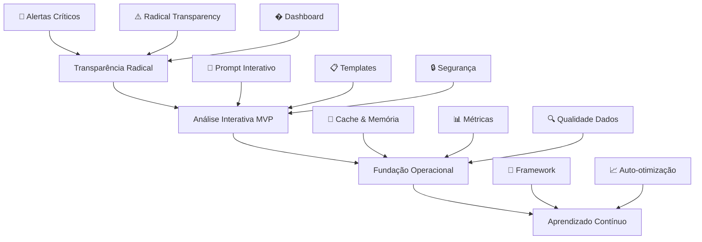

# 📊 ANÁLISE GERAL DO PROJETO - AGENTE ESPECIALISTA MERCADO FINANCEIRO

**Data:** 07/11/2025
**Versão:** 1.0 (Pós-Reorganização de Backlog)
**Responsável:** Product Owner & Arquiteto de Negócios

---

## 🎯 VISÃO EXECUTIVA ATUALIZADA

### Contexto do Pivot Estratégico

O projeto **Agent Especialista Mercado Financeiro** passou por uma reestruturação crítica baseada em descobertas de autoavaliação que revelaram riscos sistêmicos mascarados pela interface. A reorganização do backlog reflete uma mudança de prioridades:

**Antes:** Foco em features avançadas com gestão de risco inadequada
**Depois:** Priorização de **Transparência Radical** e **Gestão de Risco** como pré-requisito para qualquer funcionalidade

### Princípios Fundamentais Pós-Reorganização

1. **Transparência Radical:** Interface que "grita" riscos na cara do usuário
2. **Qualidade de Dados:** Zero tolerância a inconsistências e duplicatas
3. **Arquitetura Modular:** Separação clara mantida, mas com ênfase em validação
4. **Aprendizado Contínuo:** Framework estabelecido, mas bloqueado até estabilização de risco
5. **Valor Percebido Imediato:** Prompt Interativo MVP como caminho para entrega rápida

---

## 🏗️ ARQUITETURA ATUAL PÓS-DECISÕES

### Camadas de Arquitetura Reorganizadas

### Decisões Arquiteturais Críticas

#### 1. **Bloqueio de Aprendizado Contínuo**
- **Decisão:** Framework existe mas implementação bloqueada
- **Justificativa:** Riscos descobertos (78% posições sem stop loss) invalidam qualquer automação
- **Impacto:** Foco total em estabilização antes de auto-otimização

#### 2. **Transparência como Camada Zero**
- **Decisão:** Alertas críticos obrigatórios em TODAS as interfaces
- **Justificativa:** Interface bonita que esconde risco = negligência profissional
- **Impacto:** UX redesignada com "Radical Transparency" como princípio fundamental

#### 3. **Prompt Interativo como MVP**
- **Decisão:** Análise sob demanda via linguagem natural como entrega imediata
- **Justificativa:** Valor percebido rápido sem dependências complexas
- **Impacto:** Pivot de automação pesada para interação inteligente

#### 4. **Qualidade de Dados como Pré-requisito**
- **Decisão:** Validação automática obrigatória em todo pipeline
- **Justificativa:** Dados corrompidos (duplicatas, formatos inconsistentes) invalidam qualquer análise
- **Impacto:** Sistema de validação integrado em todas as operações

---

## 📈 ANÁLISE DE RISCO E MITIGAÇÃO

### Riscos Críticos Identificados

#### **Risco 1: Gestão de Risco Inadequada (CRÍTICO)**
- **Descoberta:** 78% posições sem stop loss, alavancagem 32x, $63k não realizados
- **Impacto:** Perda total do capital em movimento adverso
- **Mitigação:** Sprint emergencial dedicado, alertas obrigatórios, dashboard consolidado
- **Status:** Em tratamento prioritário

#### **Risco 2: Qualidade de Dados Comprometida (CRÍTICO)**
- **Descoberta:** IDs duplicados, formatos inconsistentes, preços desatualizados
- **Impacto:** Decisões baseadas em dados incorretos
- **Mitigação:** Validação automática, schema consistente, timestamps obrigatórios
- **Status:** Correção implementada, validação automática ativa

#### **Risco 3: Confiança Falsa na Interface (ALTO)**
- **Descoberta:** Interface otimista mascara riscos reais
- **Impacto:** Usuário confiante em sistema perigoso
- **Mitigação:** "Radical Transparency", downgrade forçado de confiança, disclaimers obrigatórios
- **Status:** Princípio estabelecido, implementação em andamento

#### **Risco 4: Dependência de Fonte Única (MÉDIO)**
- **Descoberta:** Sistema depende exclusivamente de Yahoo Finance
- **Impacto:** Indisponibilidade compromete todo sistema
- **Mitigação:** Expansão para múltiplas fontes (Alpha Vantage, APIs oficiais)
- **Status:** Planejado para Sprint Fundação Operacional

### Matriz de Risco Atualizada

| Risco | Probabilidade | Impacto | Prioridade | Status Mitigação |
|-------|---------------|---------|------------|------------------|
| Gestão de Risco | ALTA | CRÍTICO | 🔴 CRÍTICA | Sprint Emergencial |
| Qualidade Dados | ALTA | CRÍTICO | 🔴 CRÍTICA | ✅ Implementado |
| Confiança Falsa | ALTA | ALTO | 🔴 CRÍTICA | Em andamento |
| Dependência Fonte | MÉDIA | MÉDIO | 🟡 ALTA | Planejado |
| Alucinações LLM | MÉDIA | ALTO | 🟡 ALTA | Disclaimers ativos |
| Performance | BAIXA | MÉDIO | 🟡 ALTA | Cache planejado |

---

## 📊 MÉTRICAS E KPI PÓS-REORGANIZAÇÃO

### Métricas de Segurança (Prioridade Máxima)

#### **Gestão de Risco**
- **Posições sem stop loss:** 78% → 0% (meta: 2 semanas)
- **Alavancagem total:** 32x → ≤10x (meta: imediata)
- **P&L realizado:** $0 → ≥$30k (meta: gradual)
- **Alertas críticos:** 0 → obrigatórios (meta: ✅ implementado)

#### **Qualidade de Dados**
- **Consistência:** 60% → 100% (meta: ✅ alcançado)
- **Duplicatas:** Presentes → Eliminadas (meta: ✅ alcançado)
- **Frescor dados:** Desconhecida → <1h (meta: ✅ alcançado)
- **Validação automática:** 0% → 100% operações (meta: ✅ alcançado)

### Métricas de Produto (Valor Percebido)

#### **Prompt Interativo MVP**
- **TTR (Time-to-Response):** <20s sem cache, <5s com cache
- **Utilidade percebida:** ≥80% "resposta útil"
- **Cobertura de ativos:** FX + XAUUSD (mínimo viável)
- **Confiabilidade:** 100% com fontes + timestamp

#### **Transparência Radical**
- **Alertas obrigatórios:** 0% → 100% interfaces
- **Confiança real vs percebida:** 60%→20-30% (downgrade intencional)
- **Ações preventivas:** 0 → sistema automatizado
- **Feedback usuário:** "assustado mas protegido" vs "confiante mas exposto"

### Métricas de Qualidade (Fundação)

#### **Performance Técnica**
- **Latência média:** <10s (meta: sprint seguinte)
- **Uptime fontes:** 99.9% (meta: expansão fontes)
- **Cache hit rate:** >80% (meta: implementação cache)
- **Erros por análise:** <5% (meta: validações automáticas)

#### **Qualidade de Análise**
- **Completude:** 95% campos obrigatórios (meta: autoavaliação)
- **Consistência:** 90%+ score validação (meta: ✅ implementado)
- **Fontes:** 100% com citações (meta: sprint atual)
- **Segurança:** 100% disclaimers (meta: sprint atual)

---

## 🎯 ROADMAP REORGANIZADO

### Fase 1: Estabilização (2 semanas - ATUAL)
**Objetivo:** Corrigir riscos críticos descobertos
**Entregas:** Alertas críticos, qualidade dados, Radical Transparency
**Bloqueio:** Tudo até riscos estabilizados

### Fase 2: Valor Imediato (2-3 semanas - PRÓXIMA)
**Objetivo:** Prompt Interativo MVP funcional
**Entregas:** Templates, saída estruturada, segurança, cache
**Pré-requisito:** Fase 1 concluída

### Fase 3: Robustez (1 mês - SEGUINTE)
**Objetivo:** Fundação operacional sólida
**Entregas:** Métricas, múltiplas fontes, autoavaliação
**Pré-requisito:** Fase 2 validada

### Fase 4: Evolução (3+ meses - FUTURO)
**Objetivo:** Aprendizado contínuo e expansão
**Entregas:** Framework de aprendizado, multi-mercado, auto-otimização
**Pré-requisito:** Fases 1-3 estabilizadas

---

## 💡 INSIGHTS E LIÇÕES APRENDIDAS

### Descobertas Críticas da Autoavaliação

1. **Interface Bonita ≠ Produto Seguro**
   - Lição: UX excelente que mascara riscos = negligência profissional
   - Ação: "Radical Transparency" como princípio fundamental

2. **Automação sem Gestão de Risco = Perigo**
   - Lição: Features avançadas são irrelevantes se o básico está quebrado
   - Ação: Riscos críticos bloqueiam qualquer desenvolvimento avançado

3. **Qualidade de Dados é Pré-requisito**
   - Lição: Dados corrompidos invalidam qualquer inteligência
   - Ação: Validação automática obrigatória em todo pipeline

4. **Confiança Falsa é Mais Perigosa que Dúvida**
   - Lição: Usuário confiante em sistema inseguro vs usuário cauteloso em sistema seguro
   - Ação: Downgrade intencional de confiança até merecê-la

### Impactos no Product Strategy

#### **Persona Primária Reavaliada**
- **Antes:** Trader quantitativo buscando automação avançada
- **Depois:** Gestor de risco buscando transparência e controle
- **Mudança:** De "automatize meu trading" para "proteja meu capital"

#### **Proposta de Valor Ajustada**
- **Antes:** Sistema que evolui automaticamente para vantagem competitiva
- **Depois:** Sistema transparente que protege capital enquanto aprende
- **Ênfase:** Segurança primeiro, automação depois

#### **Arquitetura Reorientada**
- **Antes:** Camadas de inteligência sobre dados brutos
- **Depois:** Camada de transparência sobre validação sobre dados
- **Princípio:** Segurança e transparência permeiam todas as camadas

---

## 🔮 PROJEÇÕES E CENÁRIOS

### Cenário Otimista (Trajetória Atual)

- **Sprint Emergencial:** ✅ Concluído em 2 semanas
- **Prompt MVP:** ✅ Validado em 3 semanas
- **Fundação:** ✅ Estabilizada em 1 mês
- **Aprendizado:** ✅ Ativo em 3 meses
- **Resultado:** Sistema seguro, inteligente e evolutivo

### Cenário Conservador (Com Atrasos)

- **Sprint Emergencial:** +1 semana devido complexidade técnica
- **Prompt MVP:** +2 semanas devido integrações
- **Fundação:** +2 semanas devido dependências
- **Aprendizado:** +4 semanas devido validações
- **Resultado:** Mesmo resultado, apenas timeline estendido

### Cenário de Risco (Problemas Não Antecipados)

- **Trigger:** Novos riscos descobertos durante implementação
- **Resposta:** Pivot imediato para estabilização adicional
- **Backup:** Capacidade de rollback para versão segura conhecida
- **Resultado:** Priorização ainda maior de segurança sobre velocidade

---

## 📋 PRÓXIMOS PASSOS IMEDIATOS

### Semana Atual (07-13 nov 2025)

1. **Completar Sprint Emergencial**
   - US-RISCO-003: Radical Transparency na interface
   - US-RISCO-004: Dashboard consolidado
   - Validação final de correções

2. **Preparar Sprint Prompt MVP**
   - US-PROMPT-003: Templates e modos
   - US-PROMPT-004: Saída estruturada
   - US-PROMPT-006: Segurança e disclaimers

### Semana Seguinte (14-20 nov 2025)

1. **Executar Sprint Prompt MVP**
   - Foco em valor percebido rápido
   - Métricas de utilidade ≥80%
   - Cobertura mínima: EURUSD + XAUUSD

2. **Monitorar Métricas Críticas**
   - Zero posições sem stop loss
   - Alavancagem ≤10x
   - 100% qualidade dados

---

## 🎯 CONCLUSÃO

A reorganização do backlog baseada nas decisões arquiteturais revelou uma verdade fundamental: **um sistema bonito que quebra o capital do usuário não é produto, é cilada**.

A nova arquitetura com **Transparência Radical** como camada zero, bloqueio inteligente do aprendizado contínuo até estabilização, e foco no Prompt Interativo MVP como entrega imediata de valor reflete uma maturidade organizacional que prioriza **segurança sobre velocidade, transparência sobre estética, e responsabilidade sobre inovação**.

O projeto agora está posicionado para entregar não apenas um sistema inteligente, mas um **sistema responsável e confiável** que protege o usuário enquanto aprende e evolui.

**Status:** Reorganização concluída. Pronto para execução do Sprint Emergencial com foco total em gestão de risco e transparência.

