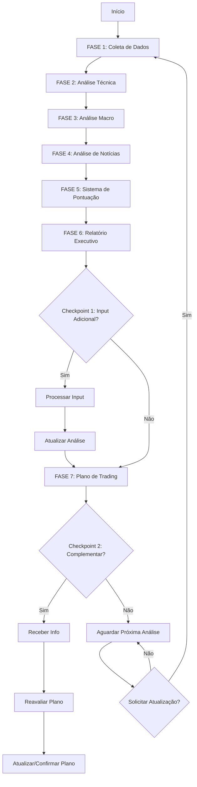

# Documentação - Prompt Mini Índice Day Trading

## Visão Geral

Este é um prompt especializado para **Day Trading do Mini Índice Brasileiro (WIN)** desenvolvido para traders que:
- Operam com gestão passiva (não podem acompanhar mercado constantemente)
- Usam ordens apregoadas em pontos estratégicos
- Buscam R$ 1.000,00 de lucro diário com risco controlado
- Iniciam com 1 contrato e podem escalar até 10 contratos

## Arquivos Relacionados

```
prompts/analise/rapida/
├── mini_indice_daytrading_v1.txt          # Versão original do usuário
└── mini_indice_daytrading_v2_otimizado.txt # Versão otimizada parametrizada

modelos/
└── win_daytrading.yaml                     # Modelo de saída estruturado

docs/
└── PROMPT_WIN_DAYTRADING.md               # Esta documentação
```

## Diferenças entre Versões

### V1 (Original)
- ✅ Captura requisitos completos do usuário
- ✅ Define fluxo de análise detalhado
- ✅ Sistema de pontuação macro
- ❌ Não parametrizado
- ❌ Formato livre (não estruturado para código)

### V2 (Otimizada)
- ✅ Totalmente parametrizada com variáveis
- ✅ Estruturada para implementação programática
- ✅ Seções claramente delimitadas por fases
- ✅ Sistema de checkpoints interativos
- ✅ Integração com modelo YAML
- ✅ Suporte a atualização contínua

## Fluxo de Execução



## Fontes de Dados

### 1. TradingView
- **URL**: https://www.tradingview.com/symbols/BMFBOVESPA-WIN1%21/
- **Dados**: Gráficos, indicadores técnicos, volume
- **Acesso**: Via widgets/embed ou scraping
- **Prioridade**: Alta

### 2. Investing.com
- **URL**: https://br.investing.com/indices/bovespa-win-futures
- **Dados**: Cotações tempo real, histórico intraday
- **Acesso**: Scraping
- **Prioridade**: Alta

### 3. BrAPI
- **URL**: https://brapi.dev/
- **Dados**: API brasileira com dados de mercado
- **Acesso**: API REST
- **Prioridade**: Média
- **Endpoint Exemplo**: `/quote/WIN`

### 4. IbovFinancials
- **URL**: https://www.ibovfinancials.com/
- **Dados**: Dados oficiais B3, open interest
- **Acesso**: API (requer token)
- **Prioridade**: Média

### 5. HG Brasil
- **URL**: https://hgbrasil.com/
- **Dados**: Cotações, indicadores, notícias
- **Acesso**: API REST
- **Prioridade**: Média

## Sistema de Pontuação Macro

### Categorias de Pontuação

| Categoria | Peso | Elementos |
|-----------|------|-----------|
| Técnico | 25% | Tendência, Volume, Momentum, Spread |
| Macro Global | 25% | DXY, VIX, Ouro, Juros US, Emergentes |
| Macro Brasil | 25% | Selic, IPCA, USD/BRL |
| Notícias | 25% | Brasil + Globais |

### Escala de Pontuação

```
+1: Favorável à operação sugerida
 0: Neutro
-1: Desfavorável à operação sugerida
```

### Interpretação do Saldo Final

```
>= +5: FORTEMENTE FAVORÁVEL
+2 a +4: FAVORÁVEL
-1 a +1: NEUTRO
-4 a -2: DESFAVORÁVEL
<= -5: FORTEMENTE DESFAVORÁVEL
```

## Conceitos Chave

### Spread
**Definição**: Maior distância entre preço atual e último suporte/resistência significativo

**Cálculo**:
```
Spread Compra = Preço Atual - Suporte Principal
Spread Venda = Resistência Principal - Preço Atual
Melhor Spread = max(Spread Compra, Spread Venda)
```

**Uso**: Determina qual lado do mercado tem melhor relação risco/ganho

### Armadilhas de Mercado (Stop Hunting)
**Definição**: Movimentos deliberados para acionar stops antes de reversão

**Identificação**:
- Movimento brusco seguido de reversão rápida
- Rompimento falso de suporte/resistência
- Volume anormal em pontas
- Gaps seguidos de fechamento

**Uso**: Identificar pontos onde liquidez foi acumulada

### Volume Profile
**Definição**: Distribuição de volume negociado em cada nível de preço

**Elementos**:
- **POC** (Point of Control): Preço com maior volume
- **VAL** (Value Area Low): Limite inferior da zona de valor
- **VAH** (Value Area High): Limite superior da zona de valor

**Uso**: Identificar zonas de aceitação e rejeição de preço

## Gestão de Risco

### Position Sizing
- Início: 1 contrato
- Reforços: Em pontos técnicos estratégicos
- Máximo: 10 contratos
- Exposição por nível: Variável conforme confiança

### Stop Loss
- **Parcial**: Protege parte da posição em primeiro sinal de reversão
- **Total**: Invalida completamente a tese de operação
- **Baseado em**: Níveis técnicos (não valores fixos)

### Take Profit
- **Objetivo 1**: Realização parcial (50% da posição)
- **Objetivo 2**: Realização de mais 30%
- **Objetivo 3**: Swing para máximo potencial (20% restante)
- **Meta**: Soma dos TPs deve superar R$ 1.000,00

## Variáveis do Sistema

### Configuráveis pelo Usuário

```python
{
    "instrumento": "WIN1!",
    "contratos_inicio": 1,
    "contratos_max": 10,
    "meta_lucro": 1000.00,
    "perfil_risco": "conservador",  # conservador, moderado, agressivo
    "janela_analise": 120  # minutos
}
```

### Calculadas Automaticamente

```python
{
    "preco_atual": fetch_from_source(),
    "variacao_dia": calculate_variation(),
    "volume_dia": fetch_volume(),
    "rsi_valor": calculate_rsi(14),
    "macd_linha": calculate_macd(),
    "saldo_macro": sum_all_points(),
    "direcao_operacao": recommend_direction(),
    "nivel_confianca": calculate_confidence()
}
```

## Checkpoints Interativos

### Checkpoint 1: Antes do Plano
**Momento**: Após relatório executivo, antes do plano de trading

**Pergunta**: "Deseja incluir alguma informação adicional na análise?"

**Casos de Uso**:
- Usuário viu notícia importante não capturada
- Tem informação privilegiada do mercado
- Observou padrão específico no gráfico
- Quer adicionar contexto adicional

**Processamento**:
1. Receber informação
2. Classificar impacto (favorável/neutro/desfavorável)
3. Atribuir pontuação (+1/0/-1)
4. Recalcular saldo macro
5. Atualizar relatório executivo
6. Prosseguir para plano de trading

### Checkpoint 2: Após o Plano
**Momento**: Após gerar plano de trading

**Pergunta**: "Deseja complementar a análise?"

**Casos de Uso**:
- Revisar plano com nova informação
- Ajustar níveis de entrada/saída
- Modificar tamanho de posição
- Validar estratégia

**Processamento**:
1. Receber informação complementar
2. Analisar impacto no plano atual
3. Determinar se requer regeneração
4. Se sim: Regenerar plano completo
5. Se não: Confirmar plano atual

## Implementação Programática

### Estrutura de Código Sugerida

```python
class AnalisadorWinDayTrading:
    def __init__(self, config):
        self.config = config
        self.fontes_dados = self._inicializar_fontes()
        self.pontuacao = PontuacaoMacro()

    def analisar(self):
        # FASE 1: Coleta
        dados = self.coletar_dados()

        # FASE 2: Técnica
        analise_tecnica = self.analisar_tecnica(dados)

        # FASE 3: Macro
        analise_macro = self.analisar_macro()

        # FASE 4: Notícias
        noticias = self.coletar_noticias()

        # FASE 5: Pontuação
        saldo = self.calcular_pontuacao(
            analise_tecnica,
            analise_macro,
            noticias
        )

        # FASE 6: Relatório
        relatorio = self.gerar_relatorio_executivo(
            analise_tecnica,
            analise_macro,
            noticias,
            saldo
        )

        # Checkpoint 1
        info_adicional = self.solicitar_input_adicional()
        if info_adicional:
            relatorio = self.atualizar_com_input(
                relatorio,
                info_adicional
            )

        # FASE 7: Plano
        plano = self.gerar_plano_trading(
            relatorio,
            analise_tecnica,
            saldo
        )

        # Checkpoint 2
        complemento = self.solicitar_complemento()
        if complemento:
            plano = self.reavaliar_plano(plano, complemento)

        return {
            "relatorio": relatorio,
            "plano": plano,
            "dados_brutos": dados
        }
```

### Integração com Modelo YAML

```python
from utils.gerenciador_modelos import gerenciador_modelos

# Obter modelo
modelo = gerenciador_modelos.obter_modelo('futuros', 'daytrading')

# Preencher com dados da análise
modelo['cotacao']['preco_atual'] = preco_atual
modelo['analise_tecnica']['tendencia']['curto_prazo'] = tendencia
modelo['pontuacao']['saldo_total'] = saldo_macro
# ... preencher outros campos

# Retornar modelo preenchido
return modelo
```

## Exemplos de Uso

### Exemplo 1: Análise Matinal

```
Horário: 09:15 (15min após abertura)
Cotação WIN: 129.450
Variação: +0.3%

Resultado:
- Tendência: Alta (força 7/10)
- Melhor Spread: COMPRA (800 pontos vs 400 pontos venda)
- Saldo Macro: +4 (FAVORÁVEL)
- Recomendação: COMPRA
- Entrada: 129.400
- Reforços: 129.100, 128.800
- Stop: 128.500
- Alvos: 130.200, 130.800, 131.500
```

### Exemplo 2: Análise Meio-Dia

```
Horário: 12:30 (meio de sessão)
Cotação WIN: 128.900
Variação: -0.2%

Resultado:
- Tendência: Lateral (força 4/10)
- Melhor Spread: NEUTRO (300 pontos cada lado)
- Saldo Macro: -1 (NEUTRO)
- Recomendação: AGUARDAR
- Justificativa: Cenário indeciso, aguardar definição
```

### Exemplo 3: Com Input do Usuário

```
[Sistema gera relatório]
Saldo Macro: +2 (FAVORÁVEL a compras)

[Checkpoint 1]
Sistema: "Deseja incluir informação adicional?"
Usuário: "SIM - Banco Central acabou de anunciar manutenção da Selic"

[Sistema processa]
- Nova informação: Manutenção Selic
- Impacto: FAVORÁVEL (+1 ponto)
- Novo Saldo: +3 (FAVORÁVEL)
- Atualização: Reforça viés de compra

[Gera plano considerando nova informação]
```

## Métricas de Sucesso

### Para o Trader
- [ ] Taxa de acerto > 60%
- [ ] Relação R/R média > 1:2
- [ ] Meta diária (R$ 1.000) atingida em 70% dos dias
- [ ] Drawdown máximo < 10% do capital

### Para o Sistema
- [ ] Tempo de análise < 5 minutos
- [ ] Dados atualizados (delay < 1 minuto)
- [ ] Taxa de erro em coleta < 5%
- [ ] Checkpoints funcionando corretamente

## Próximos Passos

### Desenvolvimento
1. [ ] Implementar classe `AnalisadorWinDayTrading`
2. [ ] Integrar fontes de dados (APIs/scraping)
3. [ ] Criar sistema de pontuação macro
4. [ ] Implementar checkpoints interativos
5. [ ] Integrar com modelo YAML
6. [ ] Criar interface CLI/Web

### Testes
1. [ ] Backtesting com dados históricos
2. [ ] Validação de níveis técnicos
3. [ ] Teste de sistema de pontuação
4. [ ] Simulação de operações
5. [ ] Paper trading por 30 dias

### Otimização
1. [ ] Ajuste de pesos do sistema de pontuação
2. [ ] Calibração de níveis de confiança
3. [ ] Otimização de pontos de entrada/saída
4. [ ] Machine learning para padrões
5. [ ] Feedback loop com resultados reais

## Suporte e Contato

**Documentação**: `docs/PROMPT_WIN_DAYTRADING.md`
**Prompt Original**: `prompts/analise/rapida/mini_indice_daytrading_v1.txt`
**Prompt Otimizado**: `prompts/analise/rapida/mini_indice_daytrading_v2_otimizado.txt`
**Modelo YAML**: `modelos/win_daytrading.yaml`

---

**Versão**: 1.0
**Data**: 05/11/2025
**Status**: Documentação Completa ✅
**Implementação**: Pendente 🔄
