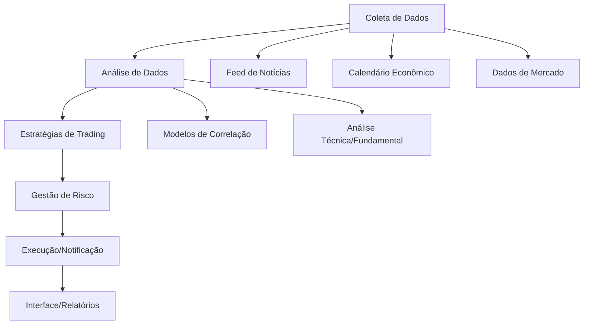

# Fluxo Arquitetural do Projeto

Este documento apresenta o fluxograma e o diagrama de arquitetura do Agent Especialista Mercado Financeiro.

## Visão Geral

O sistema é composto por módulos de ingestão de dados, análise, estratégias, risco, utilitários e interface. Abaixo, um fluxograma simplificado:

## Descrição dos Componentes

- **Coleta de Dados**: Ingestão de preços, notícias, eventos e sentimento.
- **Análise de Dados**: Processamento, validação e enriquecimento dos dados.
- **Estratégias de Trading**: Aplicação de estratégias (momentum, reversão, eventos, arbitragem).
- **Gestão de Risco**: Dimensionamento de posição, controle de drawdown, risco de correlação.
- **Execução/Notificação**: Envio de sinais, alertas e integração com corretoras.
- **Interface/Relatórios**: Dashboards, relatórios e APIs.
- **Modelos de Correlação**: Avaliação de relações multi-ativos.
- **Análise Técnica/Fundamental**: Indicadores, padrões e análise econômica.
- **Feeds**: Fontes de dados externas.

---

> Atualize este fluxograma conforme a arquitetura evoluir.
